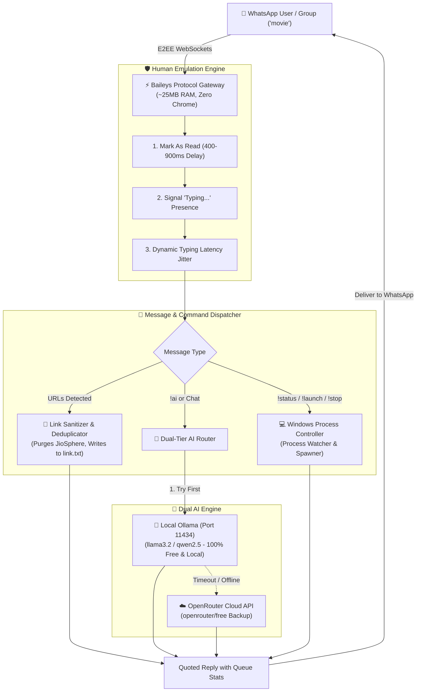

# ⚡ WhatsApp AI Agent & Local LLM Gateway (Baileys + Ollama + OpenRouter)

<p align="center">
  
  
  
  
  
  
</p>

<p align="center">
  <strong>The ultimate local-first WhatsApp AI Assistant, Link Queue Harvester, and PC Remote Control Gateway.</strong><br />
  Connects WhatsApp directly to local Ollama LLMs with automatic OpenRouter cloud failover, zero-browser WebSocket performance (~25MB RAM), and human behavior simulation to mitigate ban heuristics.
</p>

<p align="center">
  <a href="#-key-features">Key Features</a> •
  <a href="#-system-architecture">Architecture</a> •
  <a href="#-solving-baileys--anti-ban-drawbacks">Anti-Ban Engine</a> •
  <a href="#-command-directory">Commands</a> •
  <a href="#-quickstart-guide">Quickstart</a> •
  <a href="#-dual-tier-ai-routing">AI Routing</a> •
  <a href="#-faq">FAQ</a> •
  <a href="AGENTS.md">AGENTS.md</a>
</p>

---

## 📌 Keywords & Topic Tags
`whatsapp-bot` • `ollama-whatsapp` • `baileys` • `whatsapp-ai-agent` • `local-llm` • `llama3.2` • `qwen2.5` • `openrouter` • `whatsapp-automation` • `pc-remote-control` • `anti-ban` • `multi-device` • `nodejs` • `headless-whatsapp`

---

## 🌟 Key Features

* 🧠 **Dual-Tier AI Engine (100% Uptime Guarantee):**
  * **Primary:** Fast, 100% private inference via local **Ollama** (`llama3.2:1b`, `qwen2.5:3b`, etc.) on port `11434` with zero API cost.
  * **Secondary / Backup:** Seamless, automatic failover to **OpenRouter Cloud API** (`openrouter/free`) whenever your local LLM is offline, sleeping, or busy.
* 🛡️ **Human Behavior Emulation Engine (Anti-Ban):**
  * Emulates realistic human typing presence (`composing`), randomized WPM jitter latency (`1.2s - 3.5s`), and read receipts (`readMessages`) to defeat automated bot detection algorithms.
* 🖥️ **Remote PC Controller:**
  * Control Windows processes straight from WhatsApp. Send `!status` to inspect RAM/CPU/queue health, `!launch` to execute background scripts (`tenor_agent.py`), and `!stop` to terminate tasks.
* 🔗 **Smart Link Harvester & Sanitizer:**
  * Automatically extracts links from your designated group (e.g. `movie`), purges tracking parameters and JioSphere deeplink spam, and deduplicates directly into `link.txt`.
* ⚡ **Zero-Browser WebSockets Architecture:**
  * Powered by `@whiskeysockets/baileys`. Connects directly to WhatsApp's multi-device servers via raw WebSockets. Consumes **~25 MB of RAM** instead of 600MB+ consumed by Puppeteer or Selenium.
* 🔄 **Persistent Multi-File Authentication:**
  * Scan the QR code **once**. Encrypted session credentials are saved to `auth_info/` and survive machine reboots, WhatsApp restarts, and transient network drops.

---

## 🏗️ System Architecture



---

## 🥊 Solving Baileys & Anti-Ban Drawbacks

Developers frequently encounter bans, memory leaks, and protocol breaks with unofficial WhatsApp libraries. This repository implements production-grade mitigations:

| Drawback / Challenge | Traditional Bot Failure | How This Repository Solves It |
| :--- | :--- | :--- |
| **Account Ban Heuristics** | Bots reply in `0ms` without presence updates, immediately alerting Meta's heuristic anti-bot detectors. | **Human Simulation Engine:** Enforces `readMessages()` with cognitive delay, sets presence to `composing` ("typing..."), applies dynamic typing speed jitter (`1.2s - 3.5s`), and quotes messages naturally. |
| **RAM Exhaustion (500MB+)** | Puppeteer/Selenium solutions launch full Chromium windows that hog system memory. | **Pure WebSockets:** Uses Baileys socket implementation. Zero browser instances; idle memory footprint is just **~25 MB**. |
| **Session Desyncs & Logouts** | Single-file session JSONs corrupt during crashes, forcing repeated QR scans. | **Multi-File Auth State:** Uses `useMultiFileAuthState()` which isolates cryptographic key tokens into atomic files in `auth_info/`. |
| **API Cost & Cloud Privacy** | Commercial bots send personal chats to external cloud APIs. | **Local-First AI:** Primary intelligence is 100% local via Ollama. No tokens, no billing, no cloud exposure unless the user enables the optional OpenRouter fallback. |
| **Silent Failures on LLM Downtime** | If the local PC sleeps or Ollama crashes, the bot stops answering completely. | **Zero-Downtime Cloud Failover:** If Ollama doesn't answer within 7 seconds, the query is seamlessly redirected to OpenRouter (`openrouter/free`). |

---

## 🎮 Command Directory

All commands work directly in your designated WhatsApp group (e.g. `movie`) or in 1-on-1 direct messages:

| Command | Category | Action | Example Output |
| :--- | :--- | :--- | :--- |
| **`!status`** | System | Live diagnostic of PC health, agent states & queue size | `🤖 Tenor Agent: RUNNING 🟢`<br>`📋 Queue Size: 42 links waiting`<br>`🦙 Local Ollama: ONLINE ⚡ (llama3.2:1b)`<br>`☁️ OpenRouter: READY 🟢 (Backup active)` |
| **`!launch`** / **`!start`** | Controller | Spawns background worker in its own Windows window | `🚀 Tenor Agent has been launched in a new window on your PC!` |
| **`!stop`** | Controller | Halts target worker process on the host PC | `🛑 Tenor Agent process has been stopped on your PC.` |
| **`!clean`** | File Ops | Cleans blank lines, junk & duplicates in `link.txt` | `🧹 LINK.TXT CLEANED! Removed: 14 \| Remaining: 154` |
| **`!ai <prompt>`** | AI | Prompts local Ollama (with OpenRouter fallback) | *Provides instant, well-formatted response with provider badge* |
| **`!models`** | AI | Lists all installed Ollama models on the PC | `🦙 Installed Models: llama3.2:1b, qwen2.5:7b, gemma2:9b` |
| **`!model <name>`** | AI | Switches active Ollama model in real-time | `✅ Switched active Ollama model to: qwen2.5:7b` |
| **`!clear`** | AI | Resets multi-turn conversation memory | `🧹 Conversation context has been cleared!` |
| **`!help`** | Info | Displays interactive help menu | *Full command directory* |

---

## 🚀 Quickstart Guide

### 1. Prerequisites
* **Node.js**: v18.0.0 or higher (`node -v`)
* **Ollama** (Optional for local AI): [Download Ollama](https://ollama.ai) and pull a model:
  ```bash
  ollama run llama3.2:1b
  ```
* **OpenRouter API Key** (Optional for cloud fallback): Free key from [openrouter.ai](https://openrouter.ai)

### 2. Installation
```bash
git clone https://github.com/Hariprajwal/whatsapp-custom-agent.git
cd whatsapp-custom-agent
npm install
```

### 3. Configuration (`config.js` or `.env`)
Add your OpenRouter key to your `.env` file (the bot automatically detects it):
```env
OPENROUTER_API_KEY=sk-or-v1-your-key-here
```
Or customize settings directly in `config.js`:
```javascript
module.exports = {
    targetGroupKeywords: ['movie', 'movide', 'movies'],
    ollama: {
        baseUrl: 'http://localhost:11434',
        defaultModel: 'llama3.2:1b'
    },
    openrouter: {
        defaultModel: 'openrouter/free'
    }
};
```

### 4. Running the Agent

* **Mode A: Full Automation & Link Queue Controller**
  ```bash
  npm run start
  # Or double-click LAUNCH_WHATSAPP_SYNC.bat
  ```

* **Mode B: Standalone General AI Chatbot (Multi-Turn)**
  ```bash
  npm run chat
  # Or double-click LAUNCH_WHATSAPP_AI_CHAT.bat
  ```

### 5. Initial QR Code Pairing
1. On first launch, a QR code appears in your terminal.
2. Open **WhatsApp** on your phone.
3. Tap **Settings > Linked Devices > Link a Device**.
4. Scan the terminal QR code.
5. Credentials persist to `auth_info/`. You will never need to scan again!

---

## 🧠 Dual-Tier AI Routing Logic

```text
┌──────────────────────────────────────────────┐
│ User prompts WhatsApp: "!ai explain quantum"  │
└───────────────────────┬──────────────────────┘
                        │
                        ▼
       ┌─────────────────────────────────┐
       │ Step 1: Probe Local Ollama API  │
       │ (Timeout: 7000ms, Model: 3.2:1b)│
       └────────────────┬────────────────┘
                        │
         ┌──────────────┴──────────────┐
         ▼                             ▼
    [Ollama Responds]            [Ollama Fails / Offline]
         │                             │
         ▼                             ▼
  Return Local Answer          ┌───────────────────────────────────┐
  "_(⚡ Local Ollama)_"         │ Step 2: Fallback to OpenRouter    │
                               │ (Model: openrouter/free)          │
                               └────────────────┬──────────────────┘
                                                │
                                                ▼
                                       Return Cloud Answer
                                       "_(☁️ OpenRouter Backup)_"
```

---

## ❓ FAQ (Frequently Asked Questions)

### Q: Does Chrome need to be open on my PC?
**No.** This agent does not use Selenium, Puppeteer, or Chrome. It connects directly via raw WebSockets using `@whiskeysockets/baileys`. Chrome never launches and takes **zero desktop resources**.

### Q: Does my phone need to stay online 24/7?
**No.** WhatsApp Multi-Device connects your PC as an independent device. Even if your phone runs out of battery or loses internet connection, the PC agent continues running and replying normally.

### Q: Can my WhatsApp account get banned?
Unlike spam bots that message strangers at `0ms` intervals, this agent includes a **Human Emulation Engine** that sends `composing` ("typing...") presence indicators, marks messages as read with human latency, and only responds to authorized groups/commands. While any unofficial tool carries an inherent non-zero policy risk, read-only/helper bots with human emulation exhibit the lowest risk profile.

### Q: How do I switch Ollama models from WhatsApp?
Simply send `!models` in WhatsApp to view all models installed on your PC, then send `!model qwen2.5:7b` to switch the active model on the fly!

---

## 🤖 AI Crawler & Machine-Readable Specs
* **AI Architecture Guide:** See [`AGENTS.md`](AGENTS.md) for full system specifications for AI coding assistants.
* **LLM Index:** See [`llms.txt`](llms.txt) for machine-readable repository summaries.
* **Policy & Disclaimer:** See [`DISCLAIMER.md`](DISCLAIMER.md) for legal compliance and privacy standards.

---

## 📜 License
Distributed under the **MIT License**. See [LICENSE](LICENSE) for details.
