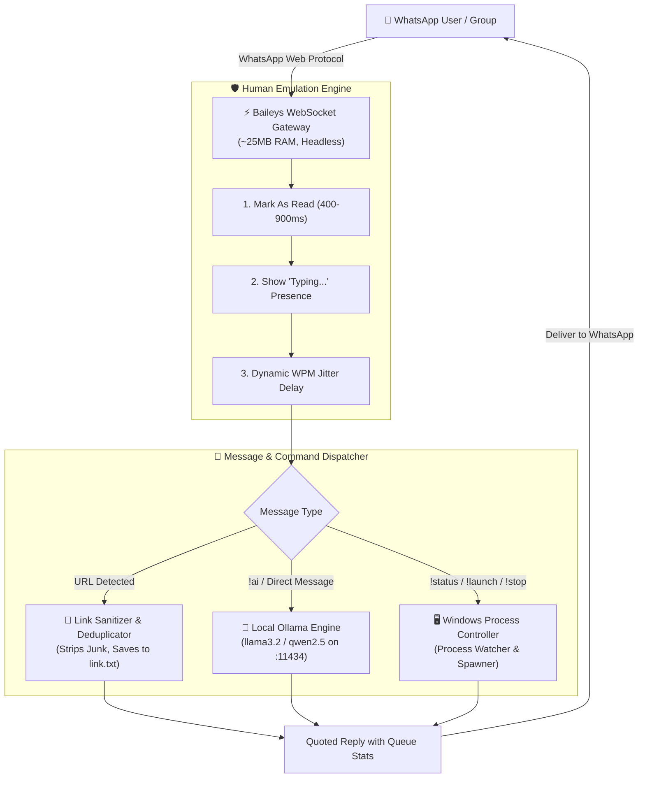

# ⚡ WhatsApp Custom Agent & Local AI Companion

<p align="center">
  
  
  
  
  
  
</p>

An autonomous, local-first WhatsApp agent that connects **WhatsApp**, your **local PC system**, and **local Ollama LLMs** (`llama3.2`, `qwen2.5`, etc.). 

It functions as both a **smart two-way WhatsApp AI chatbot** and a **remote control bridge** for your desktop automation scripts—complete with a **Human Behavior Emulation Engine** to mitigate ban risks.

---

## 🌟 Core Highlights

* 🧠 **Dual-Tier AI Engine (Ollama + OpenRouter):** Prioritizes 100% free, private local LLMs (`llama3.2`, `qwen2.5`) via Ollama. Automatically falls back to OpenRouter cloud models (`openrouter/free`) if local Ollama is offline or sleeping, guaranteeing 100% uptime!
* 🛡️ **Human Emulation Engine:** Solves common ban issues with natural typing indicators (`composing`), randomized typing latency, read receipts (`readMessages`), and Chrome desktop signatures.
* 🖥️ **PC Remote Control:** Execute, monitor, and stop background automation scripts (`tenor_agent.py`, tasks, batch scripts) straight from your phone.
* 🔗 **Smart Link Harvester & Sanitizer:** Intercepts URLs in real-time, strips tracking/JioSphere junk, deduplicates against queues (`link.txt`), and replies with queue diagnostics.
* ⚡ **Ultra-Lightweight:** Direct WebSocket communication via `@whiskeysockets/baileys`. Consumes only **~25 MB of RAM** with **zero browser overhead** (no Chromium/Chrome required).
* 🔄 **Self-Healing Reconnects:** Persistent multi-file authentication (`auth_info/`) with automatic re-handshakes on network drops.

---

## 🏗️ System Architecture



---

## 🥊 Overcoming Baileys & Unofficial Automation Drawbacks

Traditional unofficial WhatsApp bots often suffer from frequent bans, memory leaks, and protocol breaks. Here is how this repository solves each challenge:

| Known Drawback | Why It Happens | How This Project Solves It |
| :--- | :--- | :--- |
| **Account Ban Risk** | Bots reply in `0ms` without presence updates or read receipts, tripping Meta's heuristic anti-bot detectors. | **Human Simulation Engine:** Simulates realistic human behavior: calls `readMessages()`, sets presence to `composing` ("typing..."), applies dynamic typing speed jitter (`1.2s - 3.5s`), and quotes messages naturally. |
| **Heavy RAM Usage (500MB+)** | Puppeteer/Selenium solutions launch full headless Chromium instances. | **Direct WebSockets:** Uses Baileys socket protocol. Zero browser instances; idle memory footprint is just **~25 MB**. |
| **Constant Re-Logins** | Single-file session tokens corrupt easily during abnormal terminations. | **Multi-File Auth State:** Uses `useMultiFileAuthState()` which persists granular session keys independently to disk, surviving sudden PC reboots. |
| **Data Privacy & API Fees** | Commercial bots send your chats to third-party cloud servers. | **100% Local-First:** All model inference happens on your own hardware via local Ollama. No tokens, no cost, no data leaves your network. |
| **Protocol Breaking Changes** | WhatsApp updates server protocols periodically. | **Graceful Auto-Reconnect & Error Handling:** Reconnects automatically on non-fatal disconnects and cleanly prompts for re-auth only when true logouts occur. |

---

## 🕹️ Command Directory

All commands can be sent inside your designated WhatsApp group (e.g. `MOVIDE`) or in direct messages:

| Command | Action | Example Output |
| :--- | :--- | :--- |
| **`!status`** | Fetches live PC health, process state & link queue | `🤖 Tenor Agent: RUNNING 🟢`<br>`📋 Queue Size: 42 waiting`<br>`🦙 Ollama: ONLINE ⚡ (llama3.2:1b)` |
| **`!launch`** or **`!start`** | Spawns background worker in a separate window | `🚀 Tenor Agent has been launched in a new window on your PC!` |
| **`!stop`** | Gracefully halts the background agent process | `🛑 Tenor Agent process has been stopped on your PC.` |
| **`!clean`** | Deduplicates and purges junk from `link.txt` | `🧹 LINK.TXT CLEANED! Removed: 14 \| Remaining: 154` |
| **`!ai <prompt>`** | Queries local Ollama model directly | *Provides real-time local LLM answer* |
| **`!models`** | Lists all Ollama models installed on the host PC | `🦙 Installed Models: llama3.2:1b, qwen2.5:7b, gemma2:9b` |
| **`!model <name>`** | Switches active Ollama model on the fly | `✅ Switched active Ollama model to: qwen2.5:7b` |
| **`!clear`** | Clears multi-turn conversation memory | `🧹 Conversation context has been cleared!` |
| **`!help`** | Displays interactive help menu | *Full command directory* |

---

## 🚀 Quickstart Guide

### 1. Prerequisites
* **Node.js**: v18.0.0 or higher (`node -v`)
* **Ollama**: Installed and running locally (`http://localhost:11434`)
  ```bash
  ollama run llama3.2:1b
  ```

### 2. Installation
Clone the repository and install dependencies:
```bash
git clone https://github.com/Hariprajwal/whatsapp-custom-agent.git
cd whatsapp-custom-agent
npm install
```

### 3. Configuration
Edit `config.js` to customize your group name or model:
```javascript
module.exports = {
    targetGroupKeyword: 'movide', // Keyword in your WhatsApp group
    ollama: {
        baseUrl: 'http://localhost:11434',
        defaultModel: 'llama3.2:1b',
        temperature: 0.7
    }
};
```

### 4. Running the Agent

* **Option A: Full Automation & Queue Controller**
  ```bash
  npm run start
  # Or double-click LAUNCH_WHATSAPP_SYNC.bat
  ```

* **Option B: Standalone General AI Chatbot**
  ```bash
  npm run chat
  # Or double-click LAUNCH_WHATSAPP_AI_CHAT.bat
  ```

### 5. One-Time WhatsApp Authentication
1. On first run, a QR code will be rendered in your terminal.
2. Open **WhatsApp** on your phone.
3. Navigate to **Settings > Linked Devices > Link a Device**.
4. Scan the terminal QR code.
5. Your session credentials are saved to `auth_info/`. You will not need to scan again!

---

## 📁 Repository Structure

```text
├── index.js                  # Main Agent: Link Sanitizer + Remote PC Controller + Ollama
├── standalone_chat.js        # Standalone General AI Chatbot & Multi-turn Assistant
├── config.js                 # Unified Configuration (Ollama, Group keywords, Safety)
├── package.json              # Project dependencies and script shortcuts
├── DISCLAIMER.md             # Policy, Terms of Service & Safety Guidelines
├── LICENSE                   # MIT Open Source License
└── auth_info/                # Local encrypted session store (Auto-generated & gitignored)
```

---

## 🔒 Privacy & Security
* **Authentication Security:** Session keys stored in `auth_info/` contain private cryptographic tokens. They are strictly `.gitignore`d and must **never** be shared or committed.
* **No Telemetry:** This application makes zero network requests outside of your local network and WhatsApp's official WebSocket endpoints.

---

## 📜 License
Distributed under the **MIT License**. See [LICENSE](LICENSE) for details.
